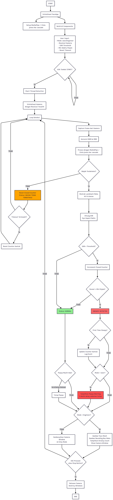
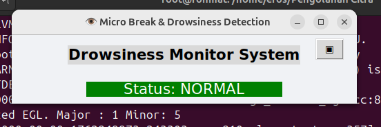
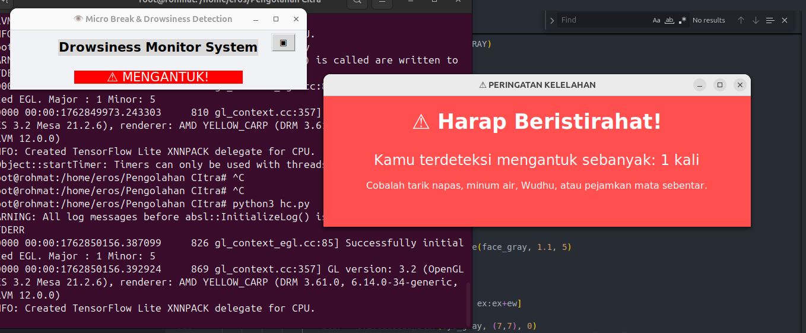
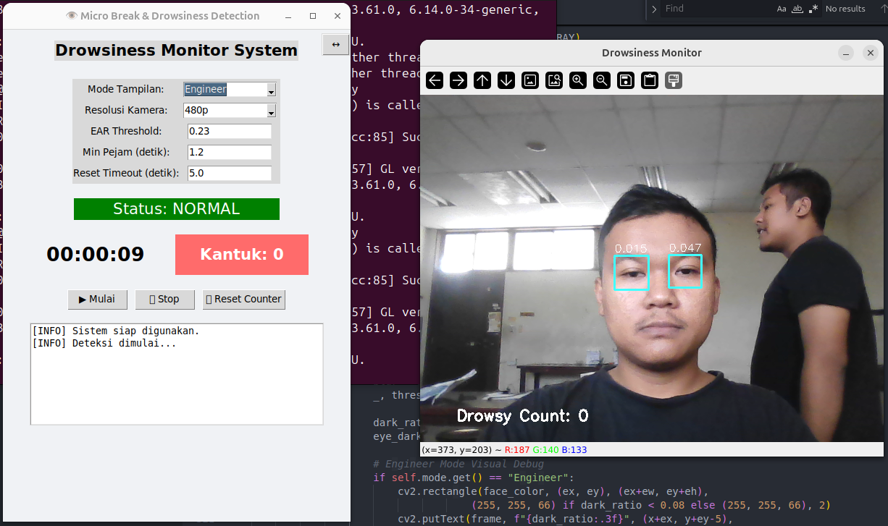
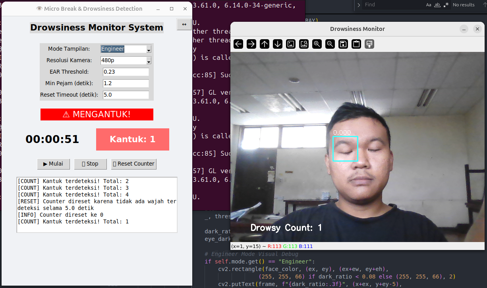
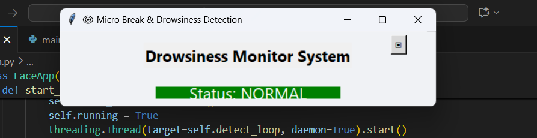
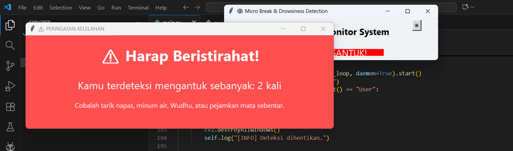
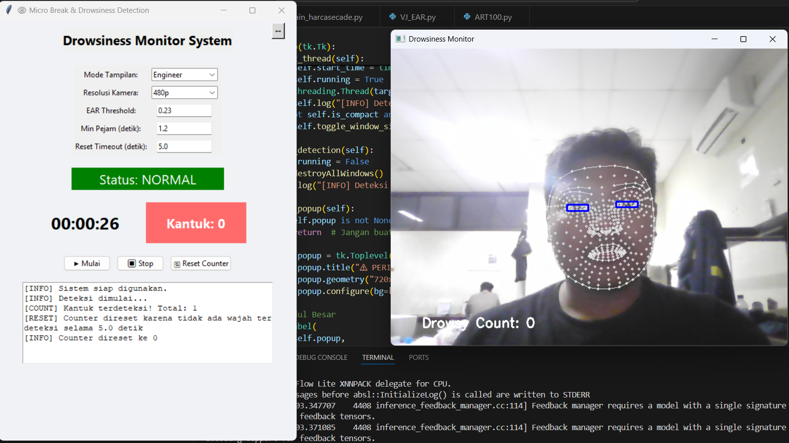
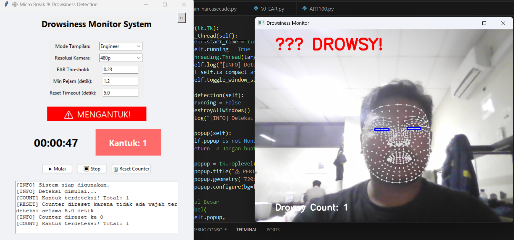

# Microsleep Detection 😴

Proyek ini bertujuan untuk mendeteksi **microsleep (kantuk singkat)** secara otomatis menggunakan data dari sensor atau kamera. Sistem ini dapat membantu meningkatkan keselamatan pengemudi dengan memberikan peringatan dini saat tanda-tanda kantuk terdeteksi.
## Support By :
>- Dosen Pengampu : Akhmad Hendriawan ST., MT. (NIP.197501272002121003)
>- Mata kuliah : Pengolahan Citra
>- Program Studi : D4 Teknik Elektronika
>- Politeknik Elektronika Negeri Surabaya  

## Teamwork
1. Nur Rohmat Hidayat (2122600012)
2. Fadlan Surya Anindita (2122600024)
3. Dwi Angga Ramadhani (2122600053)
4. Asyraf Sulthan Zaky (2122600060)

## 🚀 Fitur Utama
- Deteksi tanda-tanda kantuk berdasarkan citra wajah atau sinyal fisiologis.  
- Analisis waktu reaksi dan pola kedipan mata.  
- Peringatan otomatis (alarm visual/audio) saat terdeteksi microsleep.  
- Logging data untuk analisis lanjutan.

## 🧠 Teknologi yang Digunakan
- **Python** untuk pemrosesan data dan machine learning  
- **OpenCV / Viola jones Har cascade** untuk deteksi wajah dan mata  
- **Mediapipe** untuk mengukur mata tertutup 

## ⚙️ Diagram Alur 

## 📷 Output Metode Viola jones Har cascade

**Mode User 👁️🙂** 

 

**Mode User 👁️😴** 

 

**Mode Engineer 👁️🙂** 

 

**Mode Engineer 👁️😴** 

 

## 📷 Output Metode Mediapipe
**Mode User 👁️🙂** 

 

**Mode User 👁️😴** 

 

**Mode Engineer 👁️🙂** 

 

**Mode Engineer 👁️😴** 

 

